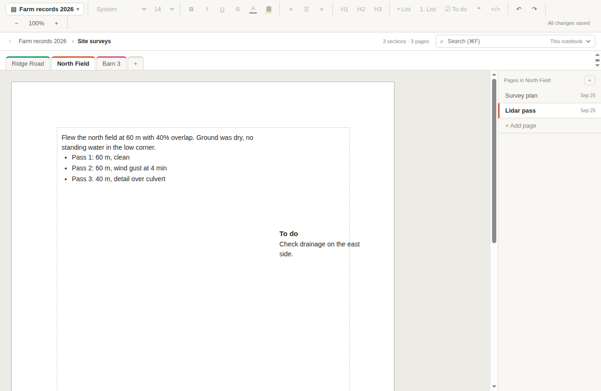

<p align="center">
  
</p>

<h1 align="center">PageBinder</h1>

<p align="center">
  Notebooks the way classic desktop OneNote did them, kept as ordinary folders on your own computer.<br>
  For macOS and Windows. No account, no cloud, nothing sent anywhere.
</p>

<p align="center">
  <a href="https://github.com/PageBinder/PageBinder/releases/latest"><b>Download the latest version</b></a>
</p>



## What it does

PageBinder organises notes into **notebooks**, **section groups**, **sections**, and **pages**. Each page is a free-form canvas: click anywhere and start typing, and place text, tables, pictures, drawings, and attached files wherever you like.

- **Your files, in plain sight.** A notebook is a folder, and each page is a folder inside it. Every page also saves a `page.html` copy that opens in any web browser, so your notes stay readable without PageBinder.
- **Nothing is lost.** Pages save themselves as you type. Earlier versions are kept in each page's history, and a damaged page is restored from its last good version automatically.
- **Rich pages.** Fonts, colours, lists, to-do lists, headings, and tables. Pictures, lines, arrows, and shapes. Any file can be attached, and saved emails (`.eml` and `.msg`) show their subject, sender, and date.
- **Fast search.** Search page text, page and section names, attachment names, and the text of attached emails as you type, even across tens of thousands of pages.
- **Print and export.** Pages print on real sheets of paper (Letter, A4, Tabloid, and more). A page, section, or whole notebook exports to one PDF or HTML file.
- **Templates.** Save any page as a template, for this notebook or for all of them.
- **Simple backups.** Copy the notebook folder to a NAS, an external drive, or any backup service. A notebook made on a Mac opens on Windows, and the other way round, with no conversion.

## Download and install

Download the installer for your computer from the [latest release](https://github.com/PageBinder/PageBinder/releases/latest). It is listed under **Assets** at the bottom of the release.

| Your computer | File to download |
|---|---|
| Mac with Apple silicon (M1 or later) | `PageBinder-<version>-arm64.dmg` |
| Mac with an Intel processor | `PageBinder-<version>-x64.dmg` |
| Windows 10 or 11 | `PageBinder-Setup-<version>.exe` |

To check which Mac you have, choose Apple menu > About This Mac. It shows **Chip** for Apple silicon, or **Processor** for Intel.

### macOS

1. Open the `.dmg` file you downloaded.
2. Drag **PageBinder** onto the **Applications** folder in the window that appears, then eject the disk image.
3. Open PageBinder from your Applications folder.

PageBinder is not yet signed with an Apple Developer ID, so the first time you open it, macOS says it cannot check the app. To open it anyway:

1. Choose **Done** (or **OK**) in the message.
2. Open **System Settings > Privacy & Security** and scroll down to the Security section.
3. Next to the note about PageBinder, choose **Open Anyway**, then confirm with your password.

You only need to do this once. On macOS 14 or earlier, you can instead right-click PageBinder in Applications, choose **Open**, and then **Open** again.

If macOS instead says PageBinder "is damaged and can't be opened", the download was marked as quarantined. Open Terminal, run this command, and then open PageBinder again:

```bash
xattr -dr com.apple.quarantine /Applications/PageBinder.app
```

### Windows

1. Run `PageBinder-Setup-<version>.exe`.
2. If Windows says it protected your PC, choose **More info**, then **Run anyway**. The installer is not yet code-signed, so Windows SmartScreen asks once.
3. Follow the installer. By default it installs for your user account only and needs no administrator rights. You can also choose the folder.

PageBinder is added to the Start menu and the desktop.

### Updating

Download the new installer and install it over the old version, as above. Your notebooks, recent-notebook list, and templates are kept.

### Uninstalling

- **macOS:** drag PageBinder from Applications to the Trash.
- **Windows:** Settings > Apps > Installed apps > PageBinder > Uninstall.

Uninstalling never touches your notebooks. The full instructions are in [docs/UNINSTALL.md](docs/UNINSTALL.md).

## Getting started

When PageBinder opens for the first time, choose **Create notebook**. It suggests your Documents folder. Keep notebooks on your computer's own disk rather than on a network share, and back them up by copying the folder.

The [Getting Started guide](docs/GETTING_STARTED.md) covers the first five minutes, backups, and search. It is also in the app under **Help**.

## Documentation

- [Getting started](docs/GETTING_STARTED.md): first steps, backups, and finding things
- [Keyboard shortcuts](docs/SHORTCUTS.md)
- [Page history and Verify Notebook](docs/HISTORY_AND_VERIFY.md)
- [Recovery guide](RECOVERY.md): what to do if a page or file is damaged or missing
- [Uninstalling](docs/UNINSTALL.md)
- [Program description](PROGRAM_DESCRIPTION.md): the full design, including the folder format

## Requirements

- macOS 12 (Monterey) or later, on Apple silicon or Intel
- Windows 10 or 11, 64-bit (x64 or ARM)

Linux should work when built from source, but it is not tested.

## Building from source

You need [Node.js](https://nodejs.org/) 22 or later and Git.

```bash
git clone https://github.com/PageBinder/PageBinder.git
cd PageBinder
npm ci            # install dependencies
npm run dev       # run the app with live reload
npm test          # unit tests
npm run dist:mac  # build the macOS installers into dist/ (on a Mac)
npm run dist:win  # build the Windows installer into dist/ (on Windows)
```

Publishing a release: push a version tag such as `v1.1.0`, or run the **Release** workflow from the Actions tab. It builds both installers and creates a draft release with them attached. Check it on the Releases page, then press **Publish**.

The [development plan](DEVELOPMENT_PLAN.md) lists what each phase added, every development command, and the source layout.
